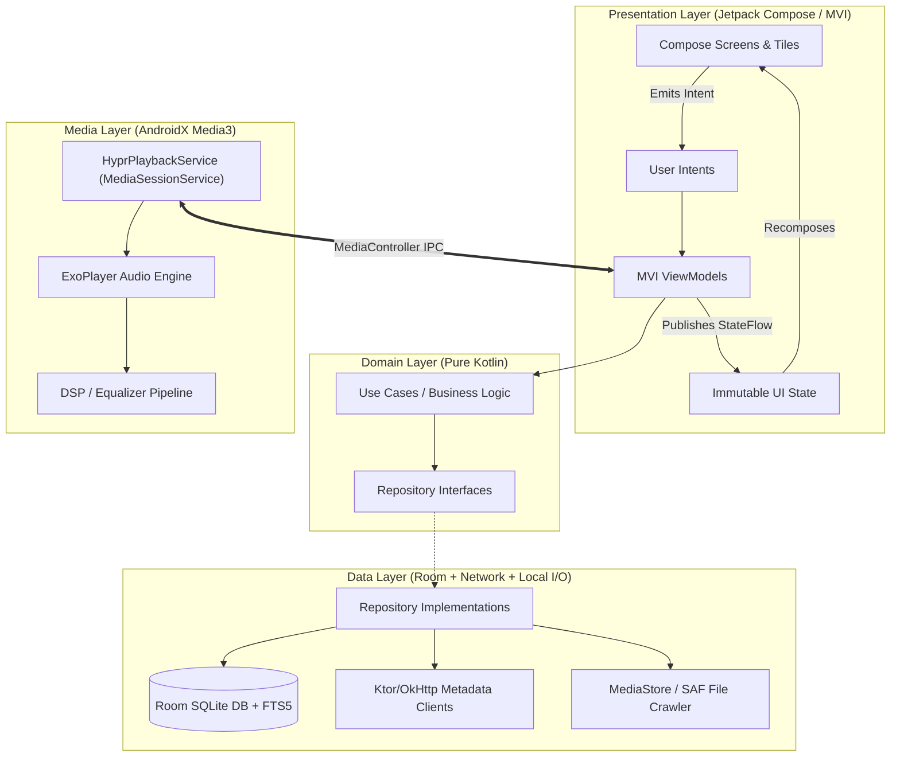
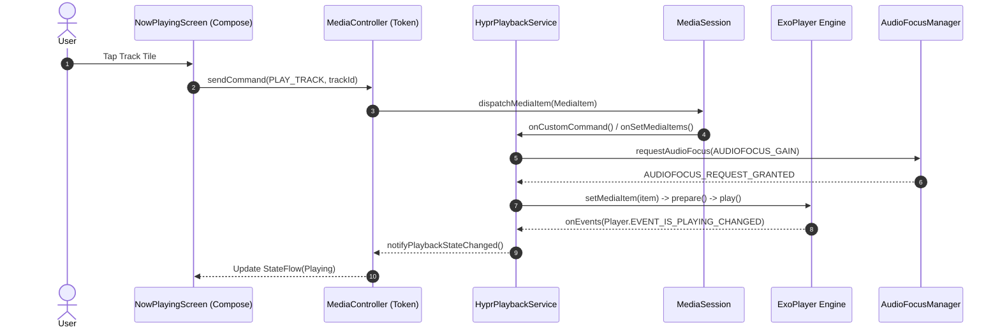
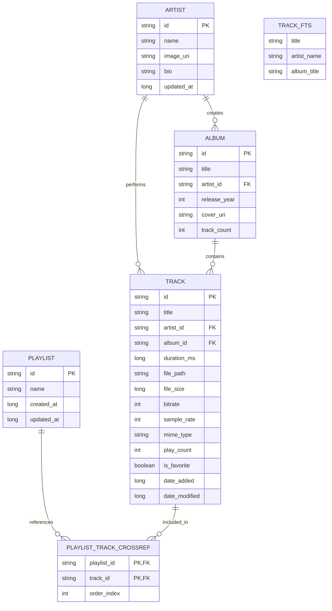

# HyprMusic: Master Architecture & Product Engineering Blueprint
**Document Version:** 2.0.0-PROD  
**Status:** Approved for Implementation  
**Target Platform:** Android 10.0+ (API Level 29 - 35)  
**Distribution:** F-Droid (GPL-3.0) / Google Play Console  
**Maintainers:** HyprMusic Core Engineering Team  

---

## 1. Executive Summary & System Vision

### 1.1 Mission Statement
**HyprMusic** is a high-fidelity, offline-first Android music orchestrator engineered to bridge the aesthetic gap between local audio archives and modern, reactive streaming platforms. Drawing deep visual and operational inspiration from the Linux Wayland ricing ecosystem (specifically the **Hyprland** dynamic tiling window manager), HyprMusic treats local media playback not as an archival utility, but as an immersive, highly customizable, audiophile-grade canvas.

### 1.2 Core Value Proposition
* **The "Riceable" Audio Experience:** Real-time adjustable window gaps, customizable active/inactive borders with glowing animated gradients, frosted glassmorphism (hardware-accelerated blur), and customizable tiling grid layouts.
* **Audiophile Playback Engine:** Bit-perfect playback powered by AndroidX Media3 (ExoPlayer), gapless transition pipeline, 10-band parametric/graphic equalizer with dynamics processing, and automatic ReplayGain loudness normalization.
* **Invisible Network Augmentation:** Seamless background metadata enrichment (high-resolution artwork, synchronized `.lrc` lyrics via LRCLIB, artist biographies via Last.fm/MusicBrainz) while maintaining a strict **Zero-Telemetry, Offline-First** architectural perimeter.
* **Instantaneous Scale:** Sub-16ms query latency across local libraries exceeding 50,000+ tracks using Room SQLite with Full-Text Search (FTS5).

---

## 2. Product Requirements Document (PRD)

### 2.1 User Personas
```
+-----------------------------------+-----------------------------------+-----------------------------------+
| 1. The Audiophile Archivist       | 2. The Linux/Android Ricer        | 3. The Offline Commuter           |
+-----------------------------------+-----------------------------------+-----------------------------------+
| * Hoards 100GB+ of FLAC/DSD.      | * Customizes every pixel (Arch/   | * Limited/intermittent cellular   |
| * Demands bit-perfect output,     |   Hyprland/KDE/Gnome user).       |   data connectivity.              |
|   gapless transitions, and custom | * Craves terminal aesthetics,     | * Demands zero battery drain, no  |
|   EQ curves per output device.    |   hex palettes, and dynamic gaps. |   background analytics, instant   |
| * Zero tolerance for audio jitter.| * Despises generic Material You.  |   app launch, and local sync.     |
+-----------------------------------+-----------------------------------+-----------------------------------+
```

### 2.2 Feature Matrix & MoSCoW Prioritization

| Priority | Feature Domain | Specification | Acceptance Criteria |
| :--- | :--- | :--- | :--- |
| **Must Have** | Media Ingestion | MediaStore + SAF Local Audio Scanner | Ingest 10,000 tracks in < 4.0s with incremental hash-based sync. |
| **Must Have** | Audio Engine | AndroidX Media3 Background Service | Gapless playback, audio focus ducking/transient handling, MediaSession. |
| **Must Have** | UI Theming | Hyprland Real-time Theming Engine | Sliders for Gaps (0-32dp), Borders (0-8dp), Blur (0-50dp), Hex Gradients. |
| **Must Have** | Lyrics Engine | Synchronized LRC Parser & Auto-Fetch | Real-time auto-scrolling with word-level/line-level interpolation. |
| **Should Have**| DSP / Audio FX | Equalizer + DynamicsProcessing API | 10-band EQ, Bass Boost, Virtualizer, ReplayGain (RG2) tag parser. |
| **Should Have**| Search Engine | SQLite FTS5 Full-Text Search | Sub-10ms search query matching title, artist, album, and directory. |
| **Should Have**| Metadata Enrichment| LRCLIB + MusicBrainz + CoverArtArchive | Non-blocking background worker; fails gracefully to offline ID3 tags. |
| **Could Have** | Scrobbling | Last.fm / Libre.fm 2.0 Scrobbler | Cached offline scrobbles flushed on Wi-Fi connection. |
| **Could Have** | Tag Editor | Jaudiotagger local ID3v2/FLAC writer | Modify tags directly on physical storage via SAF URI. |
| **Won't Have** | Cloud Streaming | No proprietary cloud audio streaming | Pure offline-first architecture; strictly local audio playback. |

### 2.3 Non-Functional Requirements & Performance SLAs
* **Cold App Launch Time:** $\le 450\text{ ms}$ on mid-tier hardware (Snapdragon 7-series / Dimensity 8000).
* **Frame Rendering Budget:** Consistent 120 FPS / 60 FPS ($0\text{ dropped frames}$) during fast scrolling in 50k track lists via lazy Compose layout recycling.
* **Audio Latency & Buffer Underrun:** Zero audible glitches during notification interruptions or app transitions. Audio buffer configuration optimized to $2500\text{ ms}$ min, $5000\text{ ms}$ max.
* **Memory Footprint:** Resident memory $\le 110\text{ MB}$ during active playback with hardware blur shaders enabled.
* **Battery Consumption:** $\le 2.5\%$ discharge per hour of continuous background playback over Bluetooth LDAC/A2DP.

---

## 3. High-Level Software Architecture

HyprMusic adheres strictly to **Clean Architecture** principles decoupled into feature and core modules, leveraging **MVI (Model-View-Intent)** with Unidirectional Data Flow (UDF).



### 3.1 Modular Project Structure
```
hyprmusic/
├── app/                          # Application entry point, Application class, DI graph assembly
├── core/
│   ├── model/                    # Immutable domain models (Track, Album, Artist, ThemeConfig)
│   ├── common/                   # Coroutine dispatchers, Result wrappers, Extensions
│   ├── database/                 # Room DB, Entity definitions, DAOs, FTS5 virtual tables
│   ├── datastore/                # Jetpack DataStore for user preferences and theme settings
│   ├── media/                    # Media3 Service, ExoPlayer orchestration, AudioFocus, Notification
│   ├── network/                  # Ktor/Retrofit clients, LRCLIB, MusicBrainz, Rate-limiters
│   └── audio-fx/                 # DynamicsProcessing, AudioEffect, Equalizer pipelines
└── feature/
    ├── home/                     # Dynamic Hyprland Tiling Dashboard
    ├── library/                  # Tracks, Albums, Artists, Folders, Fast-scroller
    ├── player/                   # Mini-player and Fullscreen Now Playing screen
    ├── lyrics/                   # Synchronized LRC parser and canvas scrolling component
    └── themer/                   # Real-time border/gap/blur customization engine
```

---

## 4. Audio Engine & Background Playback Architecture

The playback subsystem runs as an isolated, foreground-capable `MediaSessionService` using AndroidX Media3, ensuring uninterrupted playback, lockscreen controls, and system-level media integration.



### 4.1 Playback Service Implementation Contract
The background service must be registered in `AndroidManifest.xml` with the `foregroundServiceType="mediaPlayback"` attribute.

```kotlin
// Location: core/media/service/HyprPlaybackService.kt
@AndroidEntryPoint
class HyprPlaybackService : MediaSessionService() {

    @Inject lateinit var player: ExoPlayer
    @Inject lateinit var notificationProvider: HyprNotificationProvider
    private var mediaSession: MediaSession? = null

    override fun onCreate() {
        super.onCreate()
        val sessionActivityPendingIntent = PendingIntent.getActivity(
            this,
            0,
            Intent(this, Class.forName("com.hyprmusic.MainActivity")),
            PendingIntent.FLAG_IMMUTABLE or PendingIntent.FLAG_UPDATE_CURRENT
        )

        mediaSession = MediaSession.Builder(this, player)
            .setSessionActivity(sessionActivityPendingIntent)
            .setCallback(HyprMediaSessionCallback())
            .build()

        setMediaNotificationProvider(notificationProvider)
    }

    override fun onGetSession(controllerInfo: MediaSession.ControllerInfo): MediaSession? = mediaSession

    override fun onDestroy() {
        mediaSession?.run {
            player.release()
            release()
            mediaSession = null
        }
        super.onDestroy()
    }
}
```

### 4.2 Audiophile Playback Configuration
* **Renderers Factory:** `DefaultRenderersFactory(context).setExtensionRendererMode(DefaultRenderersFactory.EXTENSION_RENDERER_MODE_PREFER)` to prefer high-performance FFmpeg native audio extractors for lossless formats (FLAC, ALAC, Opus).
* **Buffer Management:** `DefaultLoadControl` tuned specifically for local storage to prevent spin-up overhead:
  * Minimum Buffer: `2500 ms`
  * Maximum Buffer: `5000 ms`
  * Buffer for Playback: `500 ms`
  * Buffer for Playback After Rebuffer: `1000 ms`
* **Audio Attributes:** Configured as `C.USAGE_MEDIA` and `C.CONTENT_TYPE_MUSIC` with automatic audio focus handling enabled via `ExoPlayer.Builder.setAudioAttributes(audioAttributes, true)`.
* **Noisy Intent Handling:** Automatically pauses playback when headphones are disconnected via `AudioManager.ACTION_AUDIO_BECOMING_NOISY`.

---

## 5. Local Persistence & Ingestion Architecture

### 5.1 Room Database Schema & Relational Design



### 5.2 Room Entity Definitions (Kotlin)

```kotlin
// Location: core/database/entity/TrackEntity.kt
@Entity(
    tableName = "tracks",
    foreignKeys = [
        ForeignKey(
            entity = ArtistEntity::class,
            parentColumns = ["id"],
            childColumns = ["artist_id"],
            onDelete = ForeignKey.CASCADE
        ),
        ForeignKey(
            entity = AlbumEntity::class,
            parentColumns = ["id"],
            childColumns = ["album_id"],
            onDelete = ForeignKey.CASCADE
        )
    ],
    indices = [
        Index(value = ["artist_id"]),
        Index(value = ["album_id"]),
        Index(value = ["file_path"], unique = true),
        Index(value = ["date_added"])
    ]
)
data class TrackEntity(
    @PrimaryKey val id: String,
    @ColumnInfo(name = "title") val title: String,
    @ColumnInfo(name = "artist_id") val artistId: String,
    @ColumnInfo(name = "album_id") val albumId: String,
    @ColumnInfo(name = "duration_ms") val durationMs: Long,
    @ColumnInfo(name = "file_path") val filePath: String,
    @ColumnInfo(name = "file_size") val fileSize: Long,
    @ColumnInfo(name = "bitrate") val bitrate: Int,
    @ColumnInfo(name = "sample_rate") val sampleRate: Int,
    @ColumnInfo(name = "mime_type") val mimeType: String,
    @ColumnInfo(name = "play_count", defaultValue = "0") val playCount: Int = 0,
    @ColumnInfo(name = "is_favorite", defaultValue = "0") val isFavorite: Boolean = false,
    @ColumnInfo(name = "date_added") val dateAdded: Long,
    @ColumnInfo(name = "date_modified") val dateModified: Long
)

// Full-Text Search Virtual Entity for instant searching
@Entity(tableName = "tracks_fts")
@Fts4(contentEntity = TrackEntity::class)
data class TrackFtsEntity(
    @PrimaryKey @ColumnInfo(name = "rowid") val rowId: Int,
    val title: String
)
```

### 5.3 High-Performance Media Scanner
1. **Source of Truth:** Scans via `MediaStore.Audio.Media.EXTERNAL_CONTENT_URI` with projection filtering `IS_MUSIC != 0`.
2. **Batch Processing:** Inserts/Updates processed in chunked transactions of 500 items via `TrackDao.upsertAll()`.
3. **Change Detection:** Employs SHA-256 or compound `(file_size + date_modified)` hashes to bypass unchanged files during incremental rescans.
4. **Tag Extraction Fallback:** For high-resolution files with missing standard tags, invokes Jaudiotagger in background worker coroutines (`Dispatchers.IO`).

---

## 6. Hyprland UI/UX Design System Specification

### 6.1 The Ricing Philosophy
HyprMusic eschews boilerplate mobile containers in favor of a **geometric, modular tiling architecture**. Visual hierarchy is communicated through spacing, luminous border states, and backdrop blur rather than opaque elevation cards.

```
+-----------------------------------------------------------+
|  Top Status Bar (Workspace Indicators: [1] [2] [3] )     |
+-----------------------------------------------------------+
|  +--------------------+  <-- Gap: 8dp                     |
|  | Active Tile        |  Border: 2dp Gradient Glowing    |
|  | Now Playing Track  |  Backdrop: Acrylic Blur 20dp      |
|  +--------------------+                                   |
|  +-----------------------------+ +----------------------+ |
|  | Heavy Rotation Grid         | | Quick Mix Tile       | |
|  |                             | |                      | |
|  +-----------------------------+ +----------------------+ |
|  +------------------------------------------------------+ |
|  | Persistent Floating Mini-Player (Tiling Dock Bar)    | |
|  +------------------------------------------------------+ |
+-----------------------------------------------------------+
```

### 6.2 Design Tokens & Theming Configuration Schema

```kotlin
// Location: core/model/ThemeConfig.kt
data class HyprThemeConfig(
    val id: String = "catppuccin_mocha",
    val name: String = "Catppuccin Mocha",
    val windowGapsDp: Int = 8,          // Adjustable: 0dp to 24dp
    val borderRadiusDp: Int = 12,       // Adjustable: 0dp (sharp) to 28dp (squircle)
    val borderThicknessDp: Int = 2,     // Adjustable: 1dp to 6dp
    val blurRadiusDp: Int = 24,         // Adjustable: 0dp (pure transparent) to 50dp
    val activeBorderGradient: List<Color>,
    val inactiveBorderColor: Color,
    val backgroundColor: Color,
    val surfaceColor: Color,
    val textPrimaryColor: Color,
    val textSecondaryColor: Color,
    val accentColor: Color,
    val isOledMode: Boolean = false
)
```

### 6.3 Curated Color Presets

| Palette | Background | Surface / Tile | Active Border Gradient | Accent |
| :--- | :--- | :--- | :--- | :--- |
| **Catppuccin Mocha** | `#1E1E2E` | `#181825` (85% Opacity) | `[#CBA6F7, [#89B4FA]]` | `#F5C2E7` |
| **Tokyo Night** | `#1A1B26` | `#16161E` (80% Opacity) | `[#7AA2F7, [#BB9AF7]]` | `#7DCFFF` |
| **Nordic Frost** | `#2E3440` | `#3B4252` (85% Opacity) | `[#88C0D0, [#81A1C1]]` | `#8FBCBB` |
| **Gruvbox Dark** | `#282828` | `#1D2021` (90% Opacity) | `[#FB4934, [#FABD2F]]` | `#B8BB26` |
| **OLED Cyberpunk** | `#000000` | `#0D0D0D` (95% Opacity) | `[#FF0055, [#00FFEE]]` | `#FFE600` |

### 6.4 Custom Hyprland Compose Modifiers
To replicate the Hyprland tiling experience natively in Jetpack Compose without composition overhead, custom modifiers encapsulate border drawing and blur effects.

```kotlin
// Location: feature/themer/modifiers/HyprModifiers.kt
fun Modifier.hyprTile(
    theme: HyprThemeConfig,
    isActive: Boolean = false
): Modifier = this
    .padding(theme.windowGapsDp.dp)
    .clip(RoundedCornerShape(theme.borderRadiusDp.dp))
    .then(
        if (Build.VERSION.SDK_INT >= Build.VERSION_CODES.S && theme.blurRadiusDp > 0) {
            Modifier.graphicsLayer {
                renderEffect = RenderEffect.createBlurEffect(
                    theme.blurRadiusDp.toFloat(),
                    theme.blurRadiusDp.toFloat(),
                    Shader.TileMode.CLAMP
                ).asComposeRenderEffect()
            }
        } else Modifier
    )
    .background(theme.surfaceColor)
    .border(
        width = theme.borderThicknessDp.dp,
        brush = if (isActive) Brush.linearGradient(theme.activeBorderGradient)
                else SolidColor(theme.inactiveBorderColor),
        shape = RoundedCornerShape(theme.borderRadiusDp.dp)
    )
```

---

## 7. Synchronized Lyrics & Metadata Integration Engine

### 7.1 LRCLIB Integration Specification
When Wi-Fi connectivity is detected (or permitted by user over cellular data), the app contacts `lrclib.net` to query time-synced lyrics using strict title/artist/album matching.

* **Base URL:** `https://lrclib.net/api`
* **Target Endpoint:** `GET /get?artist_name={artist}&track_name={title}&album_name={album}&duration={duration}`
* **Response Contract:**
```json
{
  "id": 128472,
  "trackName": "Starless",
  "artistName": "King Crimson",
  "albumName": "Red",
  "duration": 743.0,
  "instrumental": false,
  "plainLyrics": "Sundown dazzling day...",
  "syncedLyrics": "[04:28.12] Sundown dazzling day\n[04:34.40] Gold through my eyes\n[04:40.15] ..."
}
```

### 7.2 High-Performance LRC Parser State Machine
The parser compiles raw `.lrc` strings into an optimized binary array sorted by millisecond offsets, supporting standard line-level `[mm:ss.xx]` and word-level `[mm:ss.xxx]` timestamps.

```kotlin
// Location: feature/lyrics/parser/LrcParser.kt
data class LyricLine(val timestampMs: Long, val text: String)

object LrcParser {
    private val LRC_REGEX = Regex("""^\[(\d{2}):(\d{2})\.(\d{2,3})\](.*)""")

    fun parse(rawLrc: String): List<LyricLine> {
        return rawLrc.lineSequence()
            .mapNotNull { line ->
                val match = LRC_REGEX.find(line.trim()) ?: return@mapNotNull null
                val (minutes, seconds, millis, content) = match.destructured
                val msMultiplier = if (millis.length == 2) 10 else 1
                val totalMs = (minutes.toLong() * 60 * 1000) +
                              (seconds.toLong() * 1000) +
                              (millis.toLong() * msMultiplier)
                LyricLine(totalMs, content.trim())
            }
            .sortedBy { it.timestampMs }
            .toList()
    }
}
```

### 7.3 Rate-Limiting & Network Resilience Matrix
* **Client Implementation:** OkHttp with custom `Cache-Control` header storing responses locally for 30 days.
* **MusicBrainz Rate Limit:** Strict client-side token bucket limiting requests to **1 call per second** with descriptive `User-Agent: HyprMusic/2.0 ( contact@hyprmusic.dev )`.
* **Zero Offline Leakage:** When "Strict Offline Mode" is toggled, all network network adapters are killed via custom Interceptors that instantly throw `OfflineModeEnforcedException`.

---

## 8. Security, Permissions & OS Compliance

### 8.1 Android Granular Permission Matrix

| API Level | Required Permissions | Purpose | Enforcement Protocol |
| :--- | :--- | :--- | :--- |
| **Android 13+ (API 33-35)**| `POST_NOTIFICATIONS` | Foreground playback controls | Must be requested during onboarding before service start. |
| **Android 13+ (API 33-35)**| `READ_MEDIA_AUDIO` | Ingest local audio files | Strict runtime prompt with explanatory Hyprland dialog. |
| **Android 10-12 (API 29-32)**| `READ_EXTERNAL_STORAGE`| Legacy storage access | Read-only audio access. |
| **All Levels** | `FOREGROUND_SERVICE` | Background audio process | Manifest declaration with `mediaPlayback` type. |
| **All Levels** | `WAKE_LOCK` | Prevent CPU sleep during playback | Managed internally by Media3 `ExoPlayer.setWakeMode()`. |

### 8.2 Privacy Sandbox & Scoped Storage
* **Zero Telemetry Guarantee:** Absolutely no Firebase, Google Analytics, telemetry SDKs, or third-party ad networks embedded in the APK.
* **Scoped Storage (Android 10+):** All file writes (e.g., ID3 tag modifications, playlist exports) utilize Android Storage Access Framework (SAF) `DocumentFile` tree URIs. Direct `java.io.File` mutations are restricted to app-private cache directories (`context.cacheDir`).

---

## 9. Testing Strategy & Quality Assurance Matrix

```
       / \
      /   \     E2E UI & Audio Stress Tests (10%)
     /-----\    - 50,000 Track Ingestion Benchmark
    /       \   - Audio Focus Interruption Matrix (Incoming Calls/Alarms)
   /---------\  Integration Tests (30%)
  /           \ - Room DAO Queries & FTS5 Match Verifications
 /             \- Media3 Service IPC & Notification Dispatch
/---------------\ Unit Tests (60%)
                  - LRC Parser, MVI Reducers, Theme State Serialization
```

### 9.1 Audio Benchmark & Stress Test Plan
1. **Audio Focus Stutter Test:** Trigger incoming GSM call during active 96kHz/24-bit FLAC playback. Ensure smooth attenuation (ducking) and resume with zero buffer under-runs.
2. **Corrupted File Fuzzing:** Feed player corrupted, partial, and truncated MP3/FLAC/AAC payloads. Verify player catches `ParserException`, skips file safely, and raises a non-blocking toast warning.
3. **Memory Leak Profiling:** Automated LeakCanary verification across 200 consecutive track changes and Now Playing screen open/close cycles to ensure Bitmap cover art is recycled properly.

---

## 10. Build Engineering, ProGuard & Release Pipelines

### 10.1 ProGuard / R8 Optimization Rules
```proguard
# AndroidX Media3 Rules
-keep class androidx.media3.session.** { *; }
-keep class androidx.media3.exoplayer.** { *; }
-dontwarn androidx.media3.**

# Room Database Optimization
-keep class * extends androidx.room.RoomDatabase
-dontwarn androidx.room.paging.**

# Jaudiotagger (Local Tag Inspection)
-keep class org.jaudiotagger.** { *; }
-dontwarn org.jaudiotagger.**

# KotlinX Serialization & Coroutines
-keepclassmembers class * {
    @kotlinx.serialization.SerialName <fields>;
}
```

### 10.2 Continuous Integration & CD Pipeline (GitHub Actions)
```yaml
name: HyprMusic CI/CD Pipeline

on:
  push:
    branches: [ main, develop ]
  pull_request:
    branches: [ main ]

jobs:
  quality-gate:
    runs-on: ubuntu-latest
    steps:
      - uses: actions/checkout@v4
      - name: Set up JDK 17
        uses: actions/setup-java@v4
        with:
          java-version: '17'
          distribution: 'temurin'
      - name: Setup Gradle Cache
        uses: gradle/actions/setup-gradle@v3

      - name: Run Ktlint Verification
        run: ./gradlew ktlintCheck

      - name: Execute Unit & Architecture Tests
        run: ./gradlew testDebugUnitTest

      - name: Build Release APK & Bundle
        if: startsWith(github.ref, 'refs/tags/v')
        run: ./gradlew assembleRelease bundleRelease
        env:
          SIGNING_KEY_ALIAS: ${{ secrets.SIGNING_KEY_ALIAS }}
          SIGNING_KEY_PASSWORD: ${{ secrets.SIGNING_KEY_PASSWORD }}
          SIGNING_STORE_PASSWORD: ${{ secrets.SIGNING_STORE_PASSWORD }}
```

---

## 11. Engineering Implementation Roadmap (Epics & Sprints)

### Sprint 1: Foundation & Ingestion Engine (Week 1 - 2)
* [ ] **Core-101:** Configure Gradle Version Catalogs (`libs.versions.toml`) with Kotlin 2.0+ and Jetpack Compose BOM.
* [ ] **Core-102:** Implement Room DB schema with FTS5 search tables, indices, and unit tests for CRUD operations.
* [ ] **Core-103:** Build `AudioScanner` utilizing `MediaStore.Audio` with coroutine batching (`Dispatchers.IO`).
* [ ] **Core-104:** Implement SAF folder picker allowing users to whitelist/blacklist specific directories.

### Sprint 2: Audiophile Media3 Core (Week 3 - 4)
* [ ] **Audio-201:** Implement `HyprPlaybackService` extending `MediaSessionService` with custom notification management.
* [ ] **Audio-202:** Configure ExoPlayer with FFmpeg audio decoders and custom `DefaultLoadControl` buffering.
* [ ] **Audio-203:** Integrate Audio Focus request/abandon listeners with automatic transient ducking.
* [ ] **Audio-204:** Connect `MediaController` token bridging MVI ViewModels to background audio process.

### Sprint 3: The Hyprland Theming & Compose UI (Week 5 - 6)
* [ ] **UI-301:** Implement `ThemeDataStore` persisting real-time user ricing configurations.
* [ ] **UI-302:** Construct `hyprTile` modifier integrating dynamic corner radius, gap margins, and hardware blur.
* [ ] **UI-303:** Build the Home Screen dynamic tiling dashboard (Recently Added, Heavy Rotation, Quick Play).
* [ ] **UI-304:** Implement Now Playing screen with album art blur background and JetBrains Mono metadata labels.

### Sprint 4: Lyrics Engine & Metadata Enrichment (Week 7 - 8)
* [ ] **Meta-401:** Implement LRCLIB network client with disk caching and rate-limiting interceptors.
* [ ] **Meta-402:** Build the synchronized lyrics scrolling component with real-time audio playback position tracking.
* [ ] **Meta-403:** Integrate MusicBrainz Cover Art Archive fallback for missing local embedded artwork.
* [ ] **Meta-404:** Implement optional Last.fm 2.0 scrobbling queue with offline cache support.

### Sprint 5: DSP Audio FX, Hardening & Release (Week 9 - 10)
* [ ] **Polish-501:** Implement 10-band equalizer and ReplayGain parser using `DynamicsProcessing` API.
* [ ] **Polish-502:** Conduct 50,000 track memory leak and UI frame-rate profiling with Android Studio Profiler.
* [ ] **Polish-503:** Configure ProGuard/R8 release build rules and execute signed F-Droid/Play Store build.